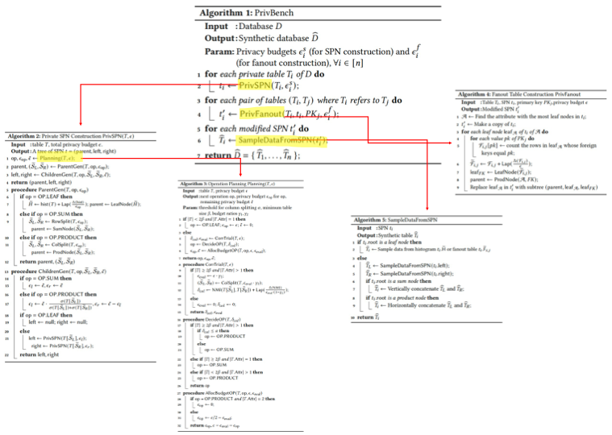
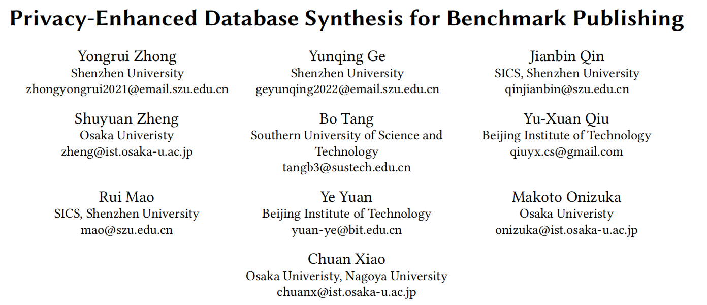
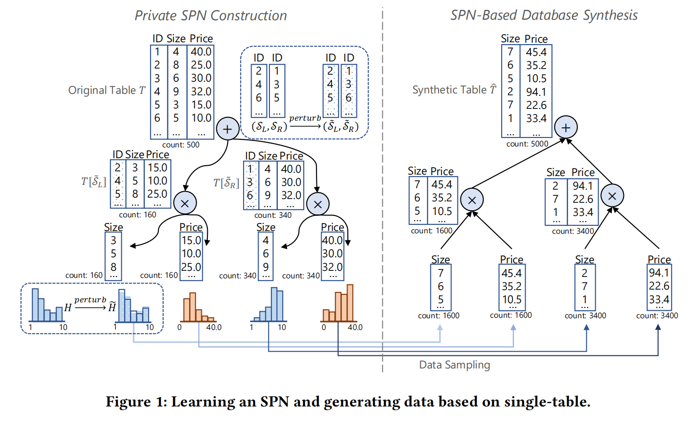
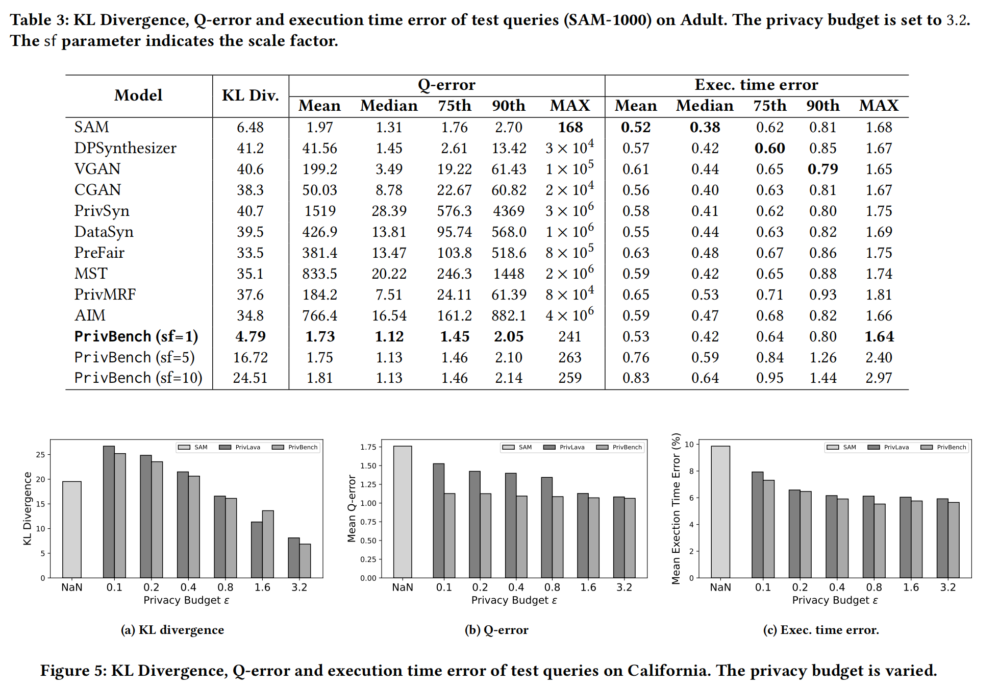

# README

This project is to run the code in paper [Privacy-Enhanced Database Synthesis for Benchmark Publishing](https://arxiv.org/abs/2405.01312). Run the code in [main.py](main.py) and you will generate a new database based on origin database.

There is a database Adult, and you can run experiment on this data.

**To Do List**

* [ ] finish code in [table](dpspn/table/table.py)
* [ ] finish code in [spn](dpspn/spn/spn.py)

There are five algorithms in paper. The relationship of this algorithms is as follows.

# Paper Read

This paper is published on arXiv in 2024 (ps: it may be published in VLDB later). The code can not be used at all and that is the reason we construct this project. The goal of this paper is to balance three important goals of database generation:

1. fidelity of generated database
2. privacy protection
3. query performance similarity

This paper construct spn tree to achieve this goal. It adds differential privacy in split operation and histogram construction (section 4), and do a detailed privacy analysis in paper (section 7).

Additionally, it provides examples in this paper.

Dpspn achieves a good experiment results in this paper.
